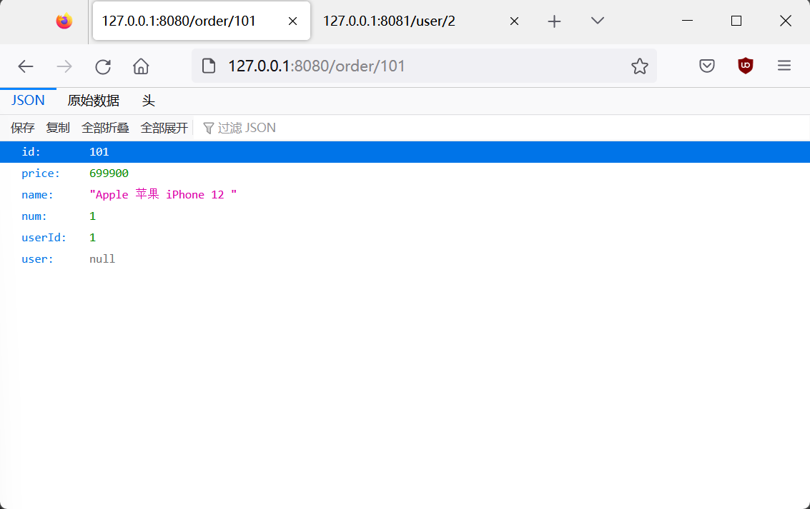
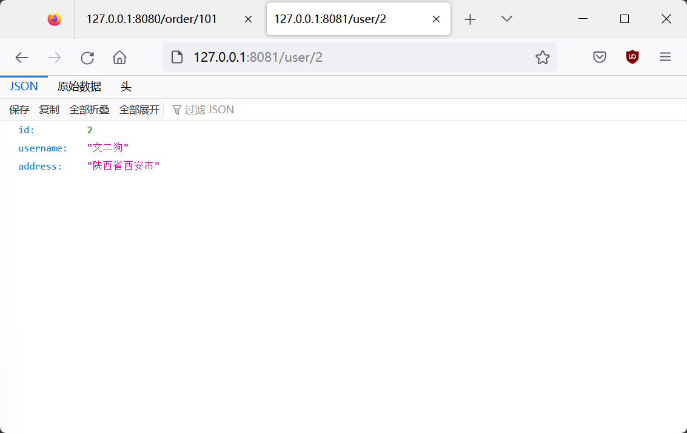

# 模块介绍

01-cloud-demo 初入微服务的服务拆分demo

02-cloud-restTemplate RestTemplate远程调用demo

03-cloud-eureka Eureka服务中心demo

04-cloud-ribbon Ribbon负载均衡demo

05-cloud-nacos Nacos注册中心demo

06-cloud-feign Feign远程调用demo

07-cloud-gateway Gateway网关demo

08-rabbitmq-demo rabbitmq消息队列

09-elasticsearch-hotel-demo elasticsearch搜索引擎

# demo-01

## 运行效果

### order-service

http://127.0.0.1:8080/order/101

### user-service

http://127.0.0.1:8081/user/2

