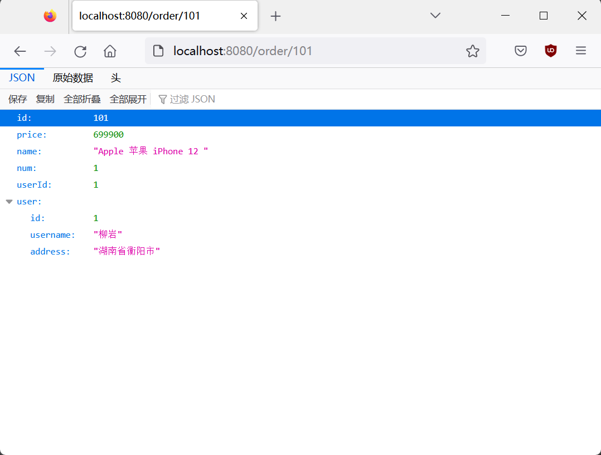

# 模块介绍

01-cloud-demo 初入微服务的服务拆分demo

02-cloud-restTemplate RestTemplate远程调用demo

03-cloud-eureka Eureka服务中心demo

04-cloud-ribbon Ribbon负载均衡demo

05-cloud-nacos Nacos注册中心demo

06-cloud-feign Feign远程调用demo

07-cloud-gateway Gateway网关demo

08-rabbitmq-demo rabbitmq消息队列

09-elasticsearch-hotel-demo elasticsearch搜索引擎


# demo-01

## 运行效果

### order-service

http://127.0.0.1:8080/order/101


### user-service

http://127.0.0.1:8081/user/2


# demo-02

**demo目的**：在demo-01的基础上实现远程调用，即让订单服务（`order-service`），调用用户服务（`user-service`），实现在查询订单信息时，能同时获取到用户信息。

**url示例**：http://localhost:8080/order/101

**运行结果**：



**返回JSON**：

```json
{"id":101,"price":699900,"name":"Apple 苹果 iPhone 12 ","num":1,"userId":1,"user":{"id":1,"username":"柳岩","address":"湖南省衡阳市"}}
```

**代码分析**：

相比于demo-01，demo-02在OrderService中新增了一个`queryOrderAndUserById`方法，该方法会在查询到订单后向用户服务（`user-service`）接口发送查询信息，从而实现在查询订单时顺便获取到用户信息的目的。

```java
    public Order queryOrderAndUserById(Long orderId) {
        // 1.查询订单
        Order order = orderMapper.findById(orderId);
        // 2.查询用户
        User user = restTemplate.getForObject("http://localhost:8081/user/" + order.getUserId(), User.class);
        // 3. 将用户信息封装进订单
        order.setUser(user);
        // 4.返回
        return order;
    }
```
