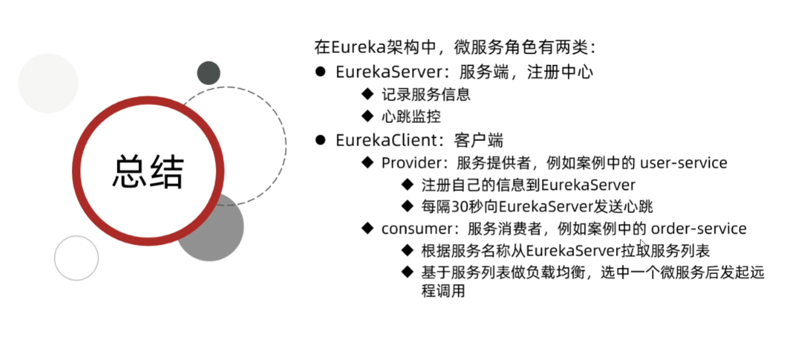
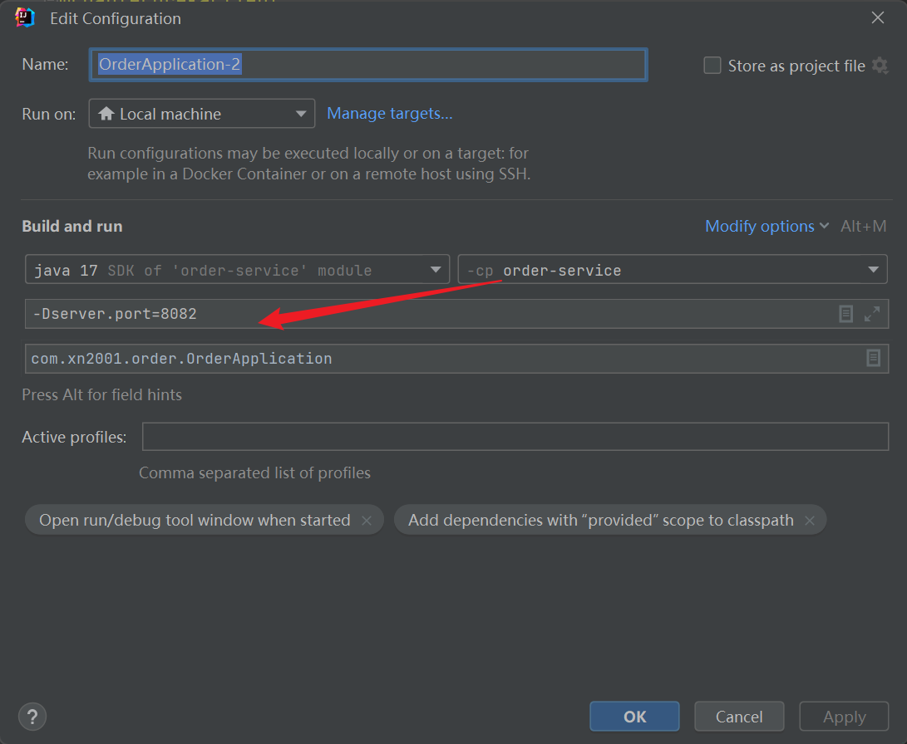
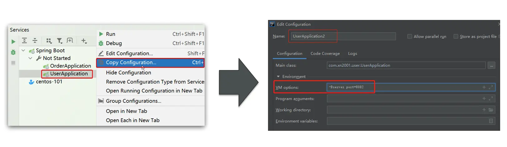
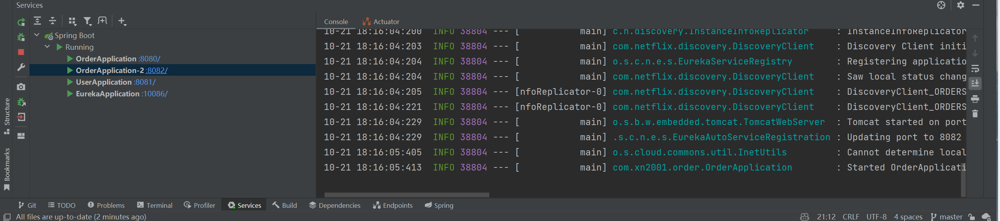
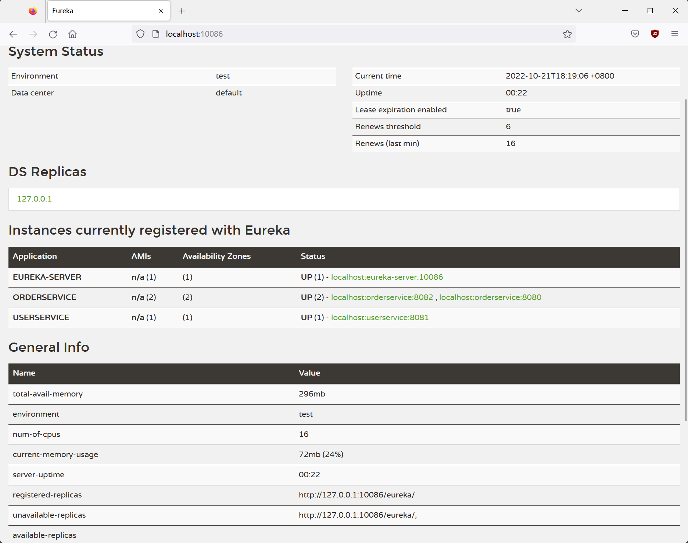

# 模块介绍

01-cloud-demo 初入微服务的服务拆分demo

02-cloud-restTemplate RestTemplate远程调用demo

03-cloud-eureka Eureka服务中心demo

04-cloud-ribbon Ribbon负载均衡demo

05-cloud-nacos Nacos注册中心demo

06-cloud-feign Feign远程调用demo

07-cloud-gateway Gateway网关demo

08-rabbitmq-demo rabbitmq消息队列

09-elasticsearch-hotel-demo elasticsearch搜索引擎


# demo-01

## 运行效果

### order-service

http://127.0.0.1:8080/order/101


### user-service

http://127.0.0.1:8081/user/2


# demo-02 远程调用

**demo目的**：在demo-01的基础上实现远程调用，即让订单服务（`order-service`），调用用户服务（`user-service`），实现在查询订单信息时，能同时获取到用户信息。

**url示例**：http://localhost:8080/order/101

**运行结果**：


**返回JSON**：

```json
{"id":101,"price":699900,"name":"Apple 苹果 iPhone 12 ","num":1,"userId":1,"user":{"id":1,"username":"柳岩","address":"湖南省衡阳市"}}
```

**代码分析**：

相比于demo-01，demo-02在OrderService中新增了一个`queryOrderAndUserById`方法，该方法会在查询到订单后向用户服务（`user-service`）接口发送查询信息，从而实现在查询订单时顺便获取到用户信息的目的。

#### 使用RestTemplate发送请求

为了向用户服务（`user-service`）的接口发送请求，我们需要一个工具来实现发送http请求。

Spring已经提供了这个工具`RestTemplate`，要使用它，只需创建一个Bean，然后使用`@Autowire`自动注入即可。

在`OrderApplication`中定义Bean

```java
    @Bean
    public RestTemplate restTemplate(){
        return new RestTemplate();
    }
```

自动装配进来

```java
    @Autowired
    private RestTemplate restTemplate;
```

使用`restTemplate`对象

```java
    public Order queryOrderAndUserById(Long orderId) {
        // 1.查询订单
        Order order = orderMapper.findById(orderId);
        // 2.查询用户
        User user = restTemplate.getForObject("http://localhost:8081/user/" + order.getUserId(), User.class);
        // 3. 将用户信息封装进订单
        order.setUser(user);
        // 4.返回
        return order;
    }
```

# demo-03 Eureka注册中心

## 基本概念

* **服务提供者**：暴露接口给其他微服务调用
* **服务消费者**：调用其他微服务提供的接口
* 这两个角色是相对而言的，所以一个服务既可以是提供者，又可以是消费者

## 服务调用时出现的问题

在`demo-02`中。

1. 服务调用的地址和端口使用的的是**硬编码**，**不适用**于灵活多变的生产环境。
2. 如果不能用硬编码
   1. **服务消费者**如何获取**服务提供者**的地址？
   2. 在存在多个**服务提供者的情况下**，**服务消费者**如何选择**服务提供者**？
   3. **服务消费者**如何得知**服务提供者**的健康状态？

这时，我们就需要用到Eureka注册中心了。

## Eureka注册中心

## 结构与原理

Eureka是时下流行的注册中心，其结构与作用图如下：


解决地址硬编码和实现灵活负载均衡的方法：

1. **服务提供者**首先会将自己的接口信息注册到**注册中心**
2. 然后**服务消费者**会从**注册中心**拉取接口信息

这样就避免了服务地址和端口硬编码造成的不灵活的问题，还能实现负载均衡。

健康检查机制：

1. **服务提供者**需要**定时汇报**自己的健康状态到**服务中心**，出现异常时，该服务提供者的地址会被注册中心**排除**。
2. 因此**服务消费者**将**不会**拉取到挂掉的服务提供者的地址信息。

这样就实现了微服务集群健康状态感知。

**order-service 如何得知 user-service 实例地址？**

- user-service 服务实例启动后，将自己的信息注册到 eureka-server(Eureka服务端)，叫做**服务注册**
- eureka-server 保存服务名称到服务实例地址列表的映射关系
- order-service 根据服务名称，拉取实例地址列表，这个叫**服务发现**或服务拉取

**order-service 如何从多个 user-service 实例中选择具体的实例？**

order-service从实例列表中利用**负载均衡算法**选中一个实例地址，向该实例地址发起远程调用

**order-service 如何得知某个 user-service 实例是否依然健康，是不是已经宕机？**

- user-service 会**每隔一段时间(默认30秒)向 eureka-server 发起请求**，报告自己状态，称为**心跳**
- 当超过一定时间没有发送心跳时，eureka-server 会认为微服务实例故障，将该实例从服务列表中剔除
- order-service 拉取服务时，就能将故障实例排除了



## 搭建注册中心

### 引入eureka-server依赖

引入依赖`spring-cloud-starter-netflix-eureka-server`，注意这里用的是**Server**，后面我们才会用到**Client**

```xml
<dependency>
    <groupId>org.springframework.cloud</groupId>
    <artifactId>spring-cloud-starter-netflix-eureka-server</artifactId>
</dependency>
```

### 在启动类中启用EurekaServer

在启动类上面添加一个`@EnableEurekaServer`注解即可启用**注册中心**功能。

```java
@SpringBootApplication
@EnableEurekaServer
public class EurekaApplication {
    public static void main(String[] args) {
        SpringApplication.run(EurekaApplication.class, args);
    }
}
```

### 编写server配置文件

```xml
server:
  port: 10086
spring:
  application:
    name: eureka-server
eureka:
  client:
    service-url:
      defaultZone: http://127.0.0.1:10086/eureka
```

其中 `default-zone` 是因为前面配置类开启了注册中心所需要配置的 eureka 的**地址信息**，因为 eureka 本身也是一个微服务，这里也要将自己注册进来，当后面 eureka **集群**时，这里就可以填写多个，使用 “,” 隔开。

## 客户端服务注册

在这一步中，我们会将 `user-service`、`order-service` 都注册到 `eureka-server`

### 引入eureka-client依赖

引入依赖`spring-cloud-starter-netflix-eureka-client`，注意这里用的是**Client**

```xml
<dependency>
    <groupId>org.springframework.cloud</groupId>
    <artifactId>spring-cloud-starter-netflix-eureka-client</artifactId>
</dependency>
```

### 在启动类中启用EurekaClient

和Server一样，也是在启动类中加一个`@EnableEurekaClient`注解就完事了。

### 编写Client配置文件

在配置文件中定义Service的名称，再指定Server的地址就OK了。

```yaml
spring:
  application:
      #name：orderservice
    name: userservice
eureka:
  client:
    service-url: 
      defaultZone: http:127.0.0.1:10086/eureka
```

### 在客户端中配置

**小技巧：快速启动多个实例**

在IDEA的`Servcie`模块，右键点击要复制的微服务实例，点击复制，然后在`VM options`项中填写一个不冲突的端口，然后就可以启动了多个实例了。

```conf
-Dserver.port=8082
```







Eureka注册中心界面：



## 客户端服务拉取

至此，我们已经完成了客户端的注册配置，但是客户端（即服务消费者）仍然配置的是硬编码，在本小节中我们将处理这个部分。

**第一步**

首先给 `RestTemplate` 这个 Bean 添加一个 `@LoadBalanced` **注解**，用于开启**负载均衡**。（后面会讲）

```java
@Bean
@LoadBalanced
public RestTemplate restTemplate(){
    return new RestTemplate();
}
```


**第二步**

修改 OrderService 访问的url路径，用**服务名**代替ip、端口：

```java
    public Order queryOrderAndUserById(Long orderId) {
        // 1.查询订单
        Order order = orderMapper.findById(orderId);
        // 2.查询用户，使用服务拉取
        User user = restTemplate.getForObject("http://userservice/user/" + order.getUserId(), User.class);
        // 3.将用户信息封装进订单
        order.setUser(user);
        // 4.返回
        return order;
    }
```

至此，spring 会自动帮助我们从 eureka-server 中，根据 userservice 这个服务名称，获取实例列表后去完成负载均衡。
